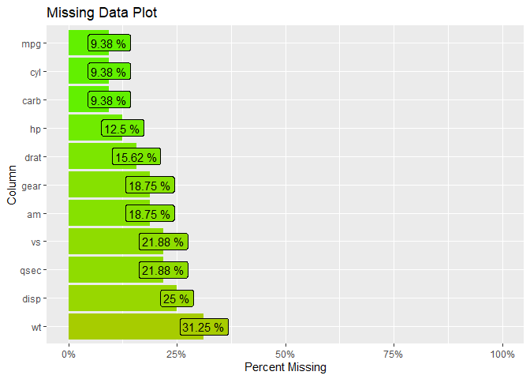
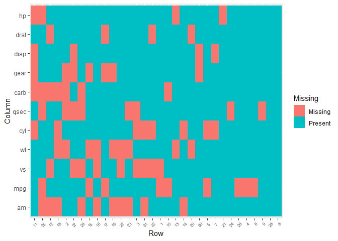

<!-- README.md is generated from README.Rmd. Please edit that file -->

# RPackage2

<!-- badges: start -->
<!-- badges: end -->

The goal of `RPackage2` is to provide examples of how to create an R
package. `RPackage2` currently version 0.0.0.9000 last built on
17-June-2024.

It includes functions for addition, multiplication, rolling dice,
flipping coins, as well as some functions we utilized in the class such
as counting missing columns.

It also includes both an
[R6](https://adv-r.hadley.nz/r6.html#r6)`::`[R6Class](https://r6.r-lib.org/articles/Introduction.html)
and [S4](https://adv-r.hadley.nz/s4.html) version of a deck of cards
where we create a deck of cards, shuffling a deck, and drawing cards
from the deck.

## Installation

You can install the development version of RPackage2 from
[GitHub](https://github.com/) with:

``` r
# install.packages("devtools")
devtools::install_github("jkylearmstrong/RPackage2")
```

## Example

Here are some basic examples:

``` r
library(RPackage2)
```

### Arithmetic

``` r
addition(1,2)
#> [1] 3
```

``` r
multiplication(5,-4)
#> [1] -20
```

``` r
multiplication(pi, complex(1,0,1)) |>
  exp() |>
  addition(1) # essentially 0, error due to floating point arithmetic
#> [1] 0+1.224606e-16i
```

### Data Analysis

``` r
mtcars |>
  missing_at_random() |>
  features_percent_miss()
#> # A tibble: 11 × 5
#>    feature SumNa SumComp PctNa PctComp
#>    <chr>   <int>   <int> <dbl>   <dbl>
#>  1 disp       16      16 0.5     0.5  
#>  2 drat       12      20 0.375   0.625
#>  3 mpg        11      21 0.344   0.656
#>  4 qsec       10      22 0.312   0.688
#>  5 am         10      22 0.312   0.688
#>  6 carb       10      22 0.312   0.688
#>  7 gear        9      23 0.281   0.719
#>  8 hp          7      25 0.219   0.781
#>  9 vs          6      26 0.188   0.812
#> 10 cyl         5      27 0.156   0.844
#> 11 wt          5      27 0.156   0.844
```

``` r
mtcars |>
  missing_at_random() |>
  features_percent_miss() |>
  plot()
```



``` r
mtcars |>
  missing_at_random() |>
  missmap()
```



### Coin and Dice

``` r
# Flip a coin 10 times
coin_flip(10)
#>  [1] "Tails" "Tails" "Tails" "Tails" "Tails" "Heads" "Heads" "Tails" "Tails"
#> [10] "Tails"
```

``` r
# Roll a 3-sided die 10 times
roll_dice(sides = 3, rolls = 10)
#>  [1] 3 2 2 3 3 3 1 1 3 1
```

### Deck of Cards (R6)

``` r
# Create a new deck
my_deck <- DeckOfCards$new()

# Shuffle the deck
my_deck$reshuffle()

# Draw cards
drawn_cards1 <- my_deck$draw(5)

# Print drawn cards
print(my_deck$drawn)
#>    Card   Suit
#> 35    9  Clubs
#> 50 Jack Spades
#> 49   10 Spades
#> 45    6 Spades
#> 30    4  Clubs
```

``` r

# should be the same
drawn_cards1 == my_deck$drawn
#>    Card Suit
#> 35 TRUE TRUE
#> 50 TRUE TRUE
#> 49 TRUE TRUE
#> 45 TRUE TRUE
#> 30 TRUE TRUE
```

``` r

# Draw more cards
drawn_cards2 <- my_deck$draw(3)

# should be the same
rbind(drawn_cards1, drawn_cards2) == my_deck$drawn
#>    Card Suit
#> 35 TRUE TRUE
#> 50 TRUE TRUE
#> 49 TRUE TRUE
#> 45 TRUE TRUE
#> 30 TRUE TRUE
#> 34 TRUE TRUE
#> 18 TRUE TRUE
#> 3  TRUE TRUE
```

``` r

# Print drawn cards
print(my_deck$drawn)
#>    Card     Suit
#> 35    9    Clubs
#> 50 Jack   Spades
#> 49   10   Spades
#> 45    6   Spades
#> 30    4    Clubs
#> 34    8    Clubs
#> 18    5 Diamonds
#> 3     3   Hearts
```

### Deck of Cards (S4)

``` r
# Create a new deck
deck <- new("DeckOfCards4", setofcards = createDeck())

# Shuffle the deck
shuffled_deck <- shuffle(deck)

head(shuffled_deck@setofcards)
#>    Card     Suit
#> 40  Ace   Spades
#> 15    2 Diamonds
#> 48    9   Spades
#> 43    4   Spades
#> 19    6 Diamonds
#> 41    2   Spades
```

``` r

# Draw cards

result <- draw(deck, deck, 5)

# Print drawn cards
result
#> $drawn
#>    Card     Suit
#> 10   10   Hearts
#> 45    6   Spades
#> 50 Jack   Spades
#> 14  Ace Diamonds
#> 34    8    Clubs
#> 
#> $object
#> An object of class "DeckOfCards4"
#> Slot "setofcards":
#>     Card     Suit
#> 20     7 Diamonds
#> 49    10   Spades
#> 35     9    Clubs
#> 8      8   Hearts
#> 17     4 Diamonds
#> 47     8   Spades
#> 12 Queen   Hearts
#> 24  Jack Diamonds
#> 42     3   Spades
#> 27   Ace    Clubs
#> 30     4    Clubs
#> 4      4   Hearts
#> 44     5   Spades
#> 9      9   Hearts
#> 33     7    Clubs
#> 22     9 Diamonds
#> 37  Jack    Clubs
#> 31     5    Clubs
#> 41     2   Spades
#> 2      2   Hearts
#> 6      6   Hearts
#> 15     2 Diamonds
#> 43     4   Spades
#> 38 Queen    Clubs
#> 11  Jack   Hearts
#> 32     6    Clubs
#> 48     9   Spades
#> 1    Ace   Hearts
#> 25 Queen Diamonds
#> 16     3 Diamonds
#> 23    10 Diamonds
#> 52  King   Spades
#> 40   Ace   Spades
#> 13  King   Hearts
#> 7      7   Hearts
#> 5      5   Hearts
#> 3      3   Hearts
#> 21     8 Diamonds
#> 18     5 Diamonds
#> 28     2    Clubs
#> 36    10    Clubs
#> 26  King Diamonds
#> 46     7   Spades
#> 39  King    Clubs
#> 51 Queen   Spades
#> 29     3    Clubs
#> 19     6 Diamonds
```
